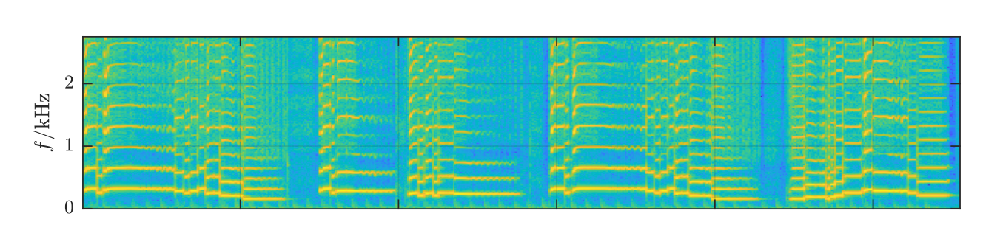
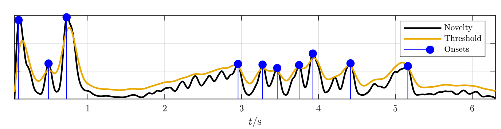

# Key and Tempo estimation
This is the repository for Applied Deep Leraning project (TUWien). The topic of this project is _Key and Tempo estimation_, type _Bring your own model_.

## Introduction

Key and Tempo are middle-level feature good to the development and the dynamics for any kind of song, classical and rock. 

The Key is the main chord of the composition where the entire chord progression and note execution lives around. If the chords played during the song are known, defining the key can be a straightforward challenge: usually the chords are composed by the simultaneous push of three notes on the piano, or many in the guitar. If the song is only composed by an execution of chords by a piano, just analyzing its log-spectrogram (better visualization than classic spectrogram) can facilitate the definition.
The following image shows the spectrogram of a single-voice saxophone, it is important to notice the clear frequencies activated, the notes, during its execution.[1]
 
This analysis cannot be generalized for any kind of song, that containes many instruments playing simultaneously and covers different frequencies in the spectrogram.
The Tempo is defined by the BPM (Beats per Minute) and it is also crucial to a better knowledge and live execution of the song. If the audio is only composed by a continuos kick that covers all the execution, the identification of the BPM is easier than in more complex drum-tracks, just looking at the onsets of the wave-form audio and the distance in seconds between each other. As stated in the previous section for the Key estimation, this analysis cannot be generalized for any kind of song. The following image describes the _novelty_ function of an audio, a particular signal representation that aims to represent the local maxima as the onset.[1]

## Approach

### Overview

Most of the feature in the music analysis can refer to high-level ones, and need more complex models that CNN and RNN cannot solve: Graph Neural Networks are used for the artist similarity [2], RNN with LSTM system for genre/mood classification [3], Gated CNN for Language Modeling [4].
The Key estimation has reached good accuracy, around 80%, with simplier technologies like CNN applied to the pre-processed audio [5], transformed into mel-spectrogram or costant-Q [6], or directional CNN applied to the mel-spectrogram in order to save the most important parameters [5], indeed the frequency has more influence than time in key estimation. The Tempo estimation is a crucial point given that it can make key estimation easier, and its typical technologies are B-RNN[7], CNN concatenated along the spectrogram [8] and directional CNN applied along the x-axis of the mel-spectrogram, in order to save the time-referred parameters.

### Methods
The adopted procedure is based on [5], applied to several changes: a directional RCNN with LSTM system for the Tempo estimation and an applied CNN  to different frames of the spectrogram for the Key estimation.
- *__Preprocessing__*: in this model the most common pre-process are used, hence the spectrogram transformation and the scattering [3], respectively for a more meaningfull representation and for more clean data to analyze
- *__Model__*: in order to give a coeherent distance hop in the spectrogram for Key estimation, the RCNN for Tempo estimation can be useful. CNN can work faster if it considers frames that depend on the BPM the model and haven't big residuals of chords from the previous frame (i.g. 120 BPM for an audio of 12 seconds, there would be 24 beats in the entire audio frame, it could be useful to use a fraction/multiple of 24 frames for the entire spectrogram). It is not required audio longer than 12 s because those features can be detected in a really strict range, like a pair of quartine in Tempo estimation, and a chord progression in Key Estimation.

## Work-breakdown 
- _data collection_: github repositories and given dataset ( Ballroom, Giantsteps etc.) 3-4h
- _preprocessing_: 10h
- _designing and building an appropriate network_: 10h
- _training and fine-tuning that network_: 10h 
- _building an application to present the results_: 10h
- _writing the final report_: 10h
- _preparing the presentation of your work_: 7h
Total time: 60-61h

## Bibliography
[1] Lerch, A. (2012). An introduction to audio content analysis: _Applications in signal processing and music informatics_. Wiley-IEEE Press.

[2] Korzeniowski, F., Oramas, S., & Gouyon, F. (2021). _Artist Similarity with Graph Neural Networks_. arXiv preprint arXiv:2107.14541.

[3] Song, G., Wang, Z., Han, F., Ding, S., & Gu, X. (2020). _Music auto-tagging using scattering transform and convolutional neural network with self-attention_. Applied Soft Computing, 96, 106702.

[4] Dauphin, Y. N., Fan, A., Auli, M., & Grangier, D. (2017, July). _Language modeling with gated convolutional networks_. In International conference on machine learning (pp. 933-941). PMLR.

[5] Schreiber, H., & Müller, M. (2019). _Musical tempo and key estimation using convolutional neural networks with directional filters_. arXiv preprint arXiv:1903.10839.

[6] Korzeniowski, F. (2018). _Harmonic Analysis of Musical Audio using Deep Neural Networks_ (Doctoral dissertation, Ph. D. Dissertation. Johannes Kepler University Linz, Linz, Austria).

[7] Mila Soares de Oliveira de Souza, Pedro Nuno de Souza Moura, Jean-Pierre Briot (2021). _Music Tempo Estimation via Neural Networks – A Comparative Analysis_. arXiv:2107.09208

[8] Schreiber, H., & Müller, M. (2018, September). _A Single-Step Approach to Musical Tempo Estimation Using a Convolutional Neural Network_ In Ismir (pp. 98-105).
