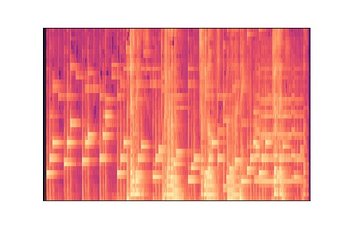
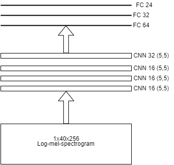
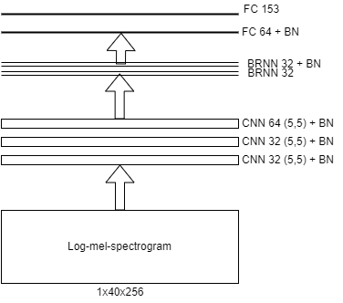

# Key and Tempo estimation
This is the repository for Applied Deep Leraning project (TUWien). The topic of this project is _Key and Tempo estimation_, type _Bring your own model_.

## Introduction

Key and Tempo are middle-level feature good to the development and the dynamics for any kind of song, classical and rock. 

The Key is the main chord of the composition where the entire chord progression and note execution lives around. If the chords played during the song are known, defining the key can be a straightforward challenge: the chords are a composition of frequencies and pitch that seems are played simultaneously, like the basic triad played on the piano or the arpeggio in the guitar. If the song is only composed by an execution of chords by a piano, just analyzing its log-spectrogram (better visualization than classic spectrogram) can facilitate the definition.
The following image shows the spectrogram of a single-voice saxophone, it is important to notice the clear frequencies activated, the notes, during its execution.[1]
 
This analysis cannot be generalized for any kind of song, that containes many instruments playing simultaneously and covers different frequencies in the spectrogram.
The Tempo is defined by the BPM (Beats per Minute) and it is also crucial to a better knowledge and live execution of the song. If the audio is only composed by a continuos kick that covers all the execution, the identification of the BPM is easier than in more complex drum-tracks, just looking at the onsets of the wave-form audio and the distance in seconds between each other. As stated in the previous section for the Key estimation, this analysis cannot be generalized for any kind of song. The following image describes the _novelty_ function of an audio, a particular signal representation that aims to represent the local maxima as the onset.[1]

## Approach

### Overview

Most of the feature in the music analysis can refer to high-level ones, and need more complex models that CNN and RNN cannot solve: Graph Neural Networks are used for the artist similarity [2], RNN with LSTM system for genre/mood classification [3], Gated CNN for Language Modeling [4].
The Key estimation has reached good accuracy, around 80%, with simplier technologies like CNN applied to the pre-processed audio [5], transformed into mel-spectrogram or costant-Q [6], or directional CNN applied to the mel-spectrogram in order to save the most important parameters [5], indeed the frequency has more influence than time in key estimation. The Tempo estimation is a crucial point given that it can make key estimation easier, and its typical technologies are B-RNN[7], CNN concatenated along the spectrogram [8] and directional CNN applied along the x-axis of the mel-spectrogram, in order to save the time-referred parameters.

### Methods
The adopted procedure is based on [5], applied to several changes: a directional RCNN with LSTM system for the Tempo estimation and an applied CNN  to different frames of the spectrogram for the Key estimation.
- *__Dataset__*: the dataset used in the two topic of analysis are: _Giantsteps-key_ and _GTZAN_ for key estimation, while _Giantsteps-Tempo_ and _ExtendedBallrom_ for tempo estimation. In order to do a better training process for the model as, it is useful to have as more data as possible, indeed a massive Data Augmentation process is done before the preprocessing. The first data augmentation applied to both the dataset is cutting the input data: sometimes the audio files are too long for the analysis, thus it is preferred to standardize the overall data in audio files of 15 sec. In this window of time it is possible to get all the essential information about key and tempo. The second data augmentation process is applied depending on which was the content of its annotation: for the key dataset it is used a pitch shifting of +2, +6 ,-2 and -6 semitones, while for the tempo dataset it is used a time stretching of 20% and -20%. For cropping, pith shifting and time stretching purpose the library _Librosa_ was used and the datasets increased from few thousands of audio, to more than 10 thousands. 
- *__Preprocessing__*: in this model the most common pre-process are used, hence the spectrogram transformation and the scattering [3], respectively for a more meaningfull representation and for more clean data to analyze. For a more effective result in its application it is decided to compute the log-melspectrogram with a _window_lenght=1024_ and _hop_size=612_. This preprocessing process creates a dataset of image with more enlighted informations, for instance it can be seen really easily that some frequencies are executed by the songs along the y axis, regarding the key estimation problem, and some timesteps along the x axis more enlighted than other, regarding the tempo estimation.
 
- *__Model__*: in order to give a coeherent distance hop in the spectrogram for Key estimation, the RCNN for Tempo estimation can be useful. CNN can work faster if it considers frames that depend on the BPM the model and haven't big residuals of chords from the previous frame (i.g. 120 BPM for an audio of 12 seconds, there would be 24 beats in the entire audio frame, it could be useful to use a fraction/multiple of 24 frames for the entire spectrogram). It is not required audio longer than 12 s because those features can be detected in a really strict range, like a pair of quartine in Tempo estimation or a chord progression in Key Estimation. 

## hacking
### Implementation
The implementation is basic because implement just in 4 notebooks and, as it will be discussed in the next paragraph, there are two separate way for the key estimation and tempo estimation model:
- "Tempo dataset preprocessing" and "Key dataset Preprocessing" that will do Data Augmentation and Pre-Processing with the database given
-  "Model for tempo estimation" and "Model for key estimation" that will create the model for the task, with its accuracy metric evaluation.
there is another possible schema that escape the preprocessing, for its real high time demanding, and is explained in both the notebooks "Model for tempo estimation" and "Model for key estimation". It will be more schematized in the following updates, with the creation of class and more stand-alone function.
### Changes with respect to the original description of the model:
The first idea of the project was the application of a common model that computes both the key and tempo using the same schema. In order to retrieve this information it was necessary to have a dataset that containes both for each single audio, but it wasn't found. Another possibility is to try estimate the hidden annotation, like the key for the tempo dataset, and it was tried using the _librosa_ library, with really low results. At the end it is preferred to build two different models that estimate separately the key and tempo.
### Model architecture 
- The model decided for key estimation is a CNN combined with Fully Connected Layers at the end. In order to get more regularization as possible, given that the there is a lot of overfitting, it is added many BatchNormalization layers and kernel regularizers of type l2.

The possible outputs of the model are the only main keys used in the actual pop-music, all the major and minor keys. The accuracy meter used is based on the possibility of error by the model that can be accepted more than other: for instance if a song is in C major and the output is G major it can be accepted more than another error like Ab minor. It is created a scale of weight of the error in order to have a more acceptable accuracy by the test dataset:
Relative fifth: error of 50% (Ex. Label: C major , Prediction: G major)
Relative minor/major: error of 75% (Ex. Label: C major, Prediction: A minor)
Parallel minor/major: error of 90% (Ex. Label: C major, Prediciotn: C minor)
Using this kind of accuracy, it increased to 30%-35% for both the database _Giantsteps_ and _GTZAN_. 
- The model computed for tempo estimation is a RCNN combined with a Fully Connected Layers at the end. The same analysis for regularization is done and moreover, during the training, is added an early stopping callback in order to avoid the borning of an overfitting behaviour.

The metrics used for the accuracy are following some rules that accept some tolerance, given that for the human ear is really difficult to distinguish the difference from a bpm (beats per minute) _x_ and _x+1_: 
if the Tempo is doubled or halfed, error of 50% (Ex. Label: 80 BPM, Prediction: 160 BPM).
In this way the accuracy increased to the 30% in the ExtendedBallroom and 50% in the Giantsteps dataset.
The expectation were bigger for the tempo estimation, it is expected an higher accuracy using in addiction this facilitating rules. During the 3rd milestone it will be tried to improve the performance of both the models, working with the number of layers and the regularization parameters.
## Work-breakdown 
- _data collection_: ExtendedBallroom and Giantsteps-tempo for Tempo estimation. GTZAN and Giantsteps-Key for Key estimation. 5h
- _data augmentation_: cropping, shifting pitch and time stretching. 30h
- _preprocessing_: 12h
- _designing an1d building an appropriate network_: 5h
- _training and fine-tuning that network_: 10h 
Total time: 60-61h

## Bibliography
[1] Lerch, A. (2012). An introduction to audio content analysis: _Applications in signal processing and music informatics_. Wiley-IEEE Press.

[2] Korzeniowski, F., Oramas, S., & Gouyon, F. (2021). _Artist Similarity with Graph Neural Networks_. arXiv preprint arXiv:2107.14541.

[3] Song, G., Wang, Z., Han, F., Ding, S., & Gu, X. (2020). _Music auto-tagging using scattering transform and convolutional neural network with self-attention_. Applied Soft Computing, 96, 106702.

[4] Dauphin, Y. N., Fan, A., Auli, M., & Grangier, D. (2017, July). _Language modeling with gated convolutional networks_. In International conference on machine learning (pp. 933-941). PMLR.

[5] Schreiber, H., & Müller, M. (2019). _Musical tempo and key estimation using convolutional neural networks with directional filters_. arXiv preprint arXiv:1903.10839.

[6] Korzeniowski, F. (2018). _Harmonic Analysis of Musical Audio using Deep Neural Networks_ (Doctoral dissertation, Ph. D. Dissertation. Johannes Kepler University Linz, Linz, Austria).

[7] Mila Soares de Oliveira de Souza, Pedro Nuno de Souza Moura, Jean-Pierre Briot (2021). _Music Tempo Estimation via Neural Networks – A Comparative Analysis_. arXiv:2107.09208

[8] Schreiber, H., & Müller, M. (2018, September). _A Single-Step Approach to Musical Tempo Estimation Using a Convolutional Neural Network_ In Ismir (pp. 98-105).
